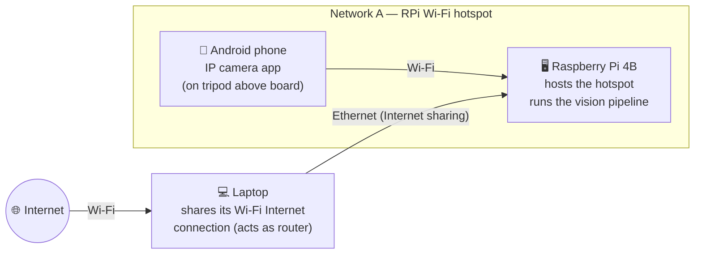

# chessvision aka Grandmaster Yolo

Track a live chess game from a single overhead camera. A phone streams the board
over MJPEG, the pipeline finds the board, perspective-warps it to a top-down
view, and a YOLO model fine-tuned on chess pieces reports what sits on each
square.

## How it works

The pipeline runs per frame in [detect_pieces.py](detect_pieces.py). Board
detection and warping live in [detect_corners_cv.py](detect_corners_cv.py),
which [detect_pieces.py](detect_pieces.py) imports:

1. **Find the board** — `find_corners()` uses OpenCV's `findChessboardCornersSB`
   to locate the 7×7 internal grid intersections. This newer variant handles poor
   lighting and partial occlusion better than the classic detector; it falls back
   to `findChessboardCorners` + sub-pixel refinement if needed.
2. **Extrapolate the outer quad** — `board_quad_from_corners()` estimates
   one-square step vectors from the corner grid and extrapolates outward to the
   board's actual edge.
3. **Warp** — `warp_board()` perspective-warps the detected quad to an 800 × 800
   top-down view.
4. **Detect pieces** — a YOLO model (12 classes: 6 piece types × {white, black})
   runs on the warped view.
5. **Map to squares** — `detections_to_board()` assigns each detection to a
   square using the box's bottom-center point (a piece's base sits on its
   square), keeping the highest-confidence detection per square.

[detect_chessboard.py](detect_chessboard.py) is an older alternative that uses a
Hough-line transform instead of the corner detector; it is still runnable as a
standalone preview.

## Setup

Requires Python ≥ 3.13. The project uses [uv](https://docs.astral.sh/uv/):

```bash
uv sync
```

## Configuration

Settings are defined in [settings.py](settings.py) and read from a `.env` file
(all keys are prefixed `GRANDMASTER_`). Copy the example and edit it:

```bash
cp .env.example .env
```

| Setting | Default | Purpose |
| --- | --- | --- |
| `GRANDMASTER_STREAM_URL` | `http://10.42.0.177:4444/stream` | Camera stream URL to read frames from |
| `GRANDMASTER_PIECES_MODEL_PATH` | `runs/detect/train/weights/best.pt` | YOLO model fine-tuned on chess pieces (inference) |
| `GRANDMASTER_TRAIN_MODEL_PATH` | `yolo26n.pt` | Base checkpoint to fine-tune from |
| `GRANDMASTER_TRAIN_DATA_YAML` | `datasets/chess-pieces/data.yaml` | Training dataset (YOLO format) |
| `GRANDMASTER_TRAIN_EPOCHS` | `100` | Training epochs |
| `GRANDMASTER_TRAIN_IMGSZ` | `640` | Training image size |
| `GRANDMASTER_TRAIN_PATIENCE` | `20` | Early-stopping patience |
| `GRANDMASTER_TRAIN_DEVICE` | `0` | GPU index for training |
| `GRANDMASTER_FLIP_ORIENTATION` | `true` | Set `true` when the warped top-left square is a1; leave `false` when it's a8 |
| `GRANDMASTER_PIECES_CONF_THRESHOLD` | `0.4` | Minimum YOLO confidence to accept a piece detection; raise (e.g. 0.5–0.7) to suppress false positives |
| `GRANDMASTER_DISPLAY_SIZE` | `800` | Minimum side length (px) to upscale the displayed board to |

## Usage

```bash
# Preview the raw camera stream
uv run view_camera.py

# Debug board detection using OpenCV's corner detector (corner overlay + warp)
uv run detect_corners_cv.py

# Debug board detection using the Hough-line approach (alternative)
uv run detect_chessboard.py

# Full pipeline: detect the board and the pieces on it
uv run detect_pieces.py

# Capture a labelled training dataset from the live stream (see below)
uv run capture_dataset.py --fen "rnbqkbnr/pppppppp/8/8/8/8/PPPPPPPP/RNBQKBNR"

# Auto-label a folder of already-saved frames
uv run autolabel_images.py --fen "<placement>" --src samples/

# Fine-tune the piece detection model
uv run train_pieces.py

# Export a trained checkpoint for fast inference on the Pi
uv run export_model.py
```

Press `ESC` to close any of the OpenCV preview windows.

### Keyboard toggles in `detect_pieces.py`

| Key | Action |
| --- | --- |
| `h` | Show / hide the help overlay |
| `d` | Toggle detection boxes and labels |
| `c` | Toggle corner overlay on the raw frame |
| `p` | Toggle printing the board state to stdout |
| `f` | Toggle board flip orientation (equivalent to `GRANDMASTER_FLIP_ORIENTATION`) |
| `s` | Save current frame as `snapshot_<n>.png` |
| `ESC` | Quit |

### Capturing a training dataset (`capture_dataset.py`)

Lets you build a YOLO-format dataset from your own pieces without any manual
annotation. Set up a physical position, run the script with the matching FEN,
and press `space` to save frames. The script uses the current model for
bounding-box proposals but replaces each box's class with the ground-truth
piece from the FEN. Squares the model missed get a synthesized grid-cell box
so the label set stays complete.

```bash
uv run capture_dataset.py \
    --fen "rnbqkbnr/pppppppp/8/8/8/8/PPPPPPPP/RNBQKBNR" \
    --infer-every 5   # run inference every 5th frame for a faster display
```

| Key | Action |
| --- | --- |
| `space` / `s` | Save current frame + label file |
| `e` | Type a new FEN in the terminal (no restart needed) |
| `v` | Paste FEN from clipboard (e.g. copied from lichess.org/editor) |
| `m` | Type a UCI move (e.g. `a7a6`) to update the position incrementally |
| `f` | Toggle board flip orientation |
| `r` | Rotate board view 90° clockwise (cycles 0→90→180→270) |
| `n` | Skip to next frame |
| `ESC` / `q` | Quit |

Every 5th capture (configurable with `--val-every`) goes to the `valid/` split;
the rest go to `train/`. A `data.yaml` is written once at startup.

> **Tip:** Use [lichess.org/editor](https://lichess.org/editor) to build positions
> fast. Drag pieces onto the board, then copy the FEN (it updates live in the URL
> and the FEN box). Press `v` in `capture_dataset.py` to paste it straight from
> the clipboard — no retyping. To cover many positions quickly, set up one
> arrangement on lichess, paste it with `v`, capture a few frames, then tweak the
> board and repeat. This lets you sweep through a wide variety of piece layouts
> in minutes.

After capturing, fine-tune from the existing weights:

```bash
GRANDMASTER_TRAIN_DATA_YAML=datasets/my-pieces/data.yaml \
GRANDMASTER_TRAIN_MODEL_PATH=models/pieces.pt \
uv run train_pieces.py
```

### Batch auto-labeling (`autolabel_images.py`)

Same idea as `capture_dataset.py` but for a folder of images you have already
saved (e.g. snapshots from `detect_pieces.py`). All images must show the same
known position. Pass `--warped` if the images are already top-down warped boards.

```bash
uv run autolabel_images.py --fen "<placement>" --src samples/
uv run autolabel_images.py --fen "<placement>" --src warped/ --warped
```

### Training

[train_pieces.py](train_pieces.py) fine-tunes a YOLO checkpoint on the
chess-pieces dataset, validates on the val split, and saves the best weights
under `models/`.

### Export

[export_model.py](export_model.py) converts a trained `.pt` checkpoint to NCNN
or ONNX for fast CPU inference on the Raspberry Pi. NCNN is the recommended
format for ARM.

```bash
uv run export_model.py                    # ncnn, imgsz 640 (default)
uv run export_model.py --imgsz 416        # smaller and faster
uv run export_model.py --format onnx --imgsz 320
```

## Hardware setup



| Component | Role |
| --- | --- |
| Android phone | Mounted on a tripod above the board, streams video via an IP camera app |
| Raspberry Pi 4B | Hosts its own Wi-Fi hotspot for the phone to join; runs the vision pipeline (`detect_pieces.py`) |
| Laptop | Connected to the RPi over Ethernet; shares its own Wi-Fi Internet connection with the RPi (acts as a router) |
| Internet | Reached by the laptop over Wi-Fi, then passed through to the RPi via Ethernet |

## Proof of Concepts

### POC 1

Detect the chessboard

### POC 2

Detect individual pieces and track them
