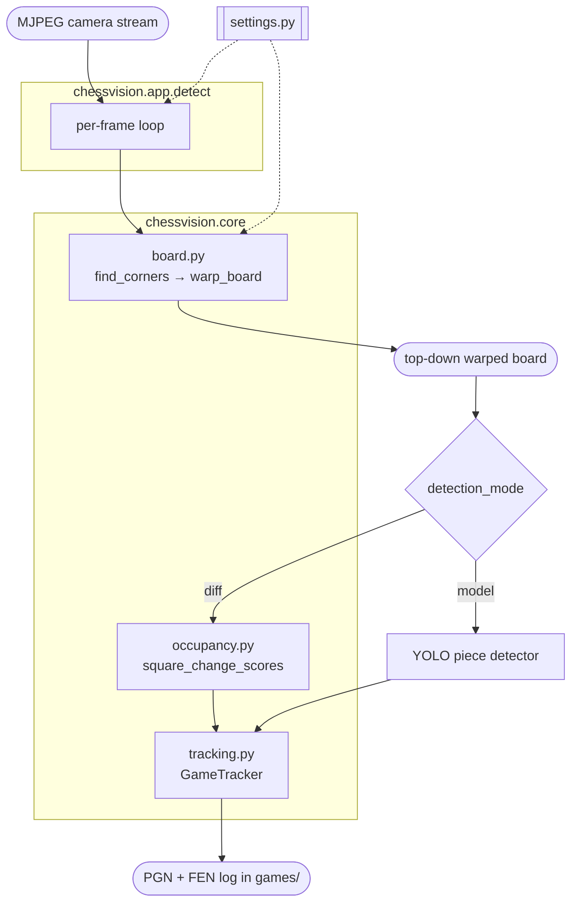

# Architecture

How a live camera frame becomes a recorded chess game.

## Module map

```
chessvision/
├── settings.py            pydantic-settings config (env prefix GRANDMASTER_)
├── core/                  shared, importable library (no GUI loops)
│   ├── board.py           find the board + perspective-warp it (OpenCV)
│   ├── occupancy.py       model-free per-square change scores (image diff)
│   ├── tracking.py        GameTracker: stable states -> legal moves -> PGN/FEN
│   └── display.py         small display helper (upscale for viewing)
├── app/                   interactive applications
│   ├── detect.py          the main app: detect/record (gm-detect)
│   ├── web_stream.py      MJPEG HTTP server for --web mode (buttons, keyboard, PGN download)
│   └── view_camera.py     raw stream preview (gm-view)
└── training/              dataset + model tooling
    ├── capture_dataset.py live model-assisted labelling (gm-capture)
    ├── autolabel_images.py batch labelling of saved frames (gm-autolabel)
    ├── train.py           fine-tune the YOLO model (gm-train)
    └── export.py          export weights to ncnn/onnx (gm-export)
```

Dependencies flow one way: `app` and `training` depend on `core`; `core`
depends only on `settings`. Nothing in `core` imports `app`.

## Data flow



## The per-frame pipeline

The loop runs in [`chessvision/app/detect.py`](../chessvision/app/detect.py).
Board geometry lives in [`chessvision/core/board.py`](../chessvision/core/board.py):

1. **Find the board** — `find_corners()` uses OpenCV's `findChessboardCornersSB`
   to locate the 7×7 internal grid intersections. This newer variant handles poor
   lighting and partial occlusion better than the classic detector; it falls back
   to `findChessboardCorners` + sub-pixel refinement if needed.
2. **Extrapolate the outer quad** — `board_quad_from_corners()` estimates
   one-square step vectors from the corner grid and extrapolates outward to the
   board's actual edge.
3. **Warp** — `warp_board()` perspective-warps the detected quad to an 800 × 800
   top-down view.
4. **Detect** — depending on `detection_mode`:
   - **`model`** — a YOLO model (12 classes: 6 piece types × {white, black}) runs
     on the warped view and `detections_to_board()` assigns each detection to a
     square using the box's bottom-center point (a piece's base sits on its
     square), keeping the highest-confidence detection per square.
   - **`diff`** — model-free image subtraction
     ([`core/occupancy.py`](../chessvision/core/occupancy.py)) reports which
     squares changed versus the last committed position. No piece identification
     needed; the move is inferred from the rules.
5. **Map to squares** — square names are produced by `square_name()`, which
   applies `board_rotation`/`flip_orientation` as a *coordinate* rotation so the
   displayed view stays in the raw camera orientation while squares still read
   correctly. See [configuration](configuration.md#board-orientation).
6. **Track the game** — [`core/tracking.py`](../chessvision/core/tracking.py)'s
   `GameTracker` turns the per-frame square map into a recorded game. Detections
   flicker, so a board state is only trusted once it has been stable for several
   frames (`GRANDMASTER_GAME_STABILITY_FRAMES`). When a stable state differs from
   the current position, the tracker asks
   [python-chess](https://python-chess.readthedocs.io/) for the legal move whose
   *resulting* placement best matches the detection — which makes captures,
   castling, en passant and promotion fall out automatically, and ignores
   detections that match no legal move. Each accepted move is written to a `.pgn`
   file and a human-readable `.fen.log` in `GRANDMASTER_GAMES_DIR`.

## Why lock the board (`k`)

`findChessboardCornersSB` needs to see the 7×7 inner grid intersections, which a
full set of pieces tends to occlude — so per-frame board detection becomes
unreliable exactly when you want to record. Locking the transform (`k`) caches
the warp and reuses it every frame, skipping corner detection entirely, so
pieces or a passing hand can't break tracking. The recommended flow is: lock on
the empty board, then place the pieces and press `r` to record.

## Web mode (`--web`)

Passing `--web [PORT]` to `gm-detect` replaces the OpenCV window with a
lightweight HTTP server (`chessvision/app/web_stream.py`):

- **`/`** — HTML page with the live MJPEG stream, control buttons, and a
  "Download recorded games" link. Buttons cover the most common actions (`r`,
  `k`, `d`, `c`, `m`, `v`, `o`, `f`); keyboard shortcuts for all keys also work
  directly in the browser via a `keydown` listener.
- **`/stream`** — raw MJPEG feed (25 fps JPEG).
- **`/cmd/<key>`** — single-character command endpoint; the per-frame loop polls
  this with `pop_command()` and maps the result to the same key-handler as the
  OpenCV `waitKey` path.
- **`/pgn`** — HTML listing of all recorded `.pgn` files, sorted newest-first.
- **`/pgn/<filename>`** — download a specific game as an attachment.

The server uses `ThreadingHTTPServer` so the long-lived `/stream` connection
doesn't block `/cmd/` or `/pgn` requests.

## Graceful shutdown

`detect.py` registers handlers for both `SIGTERM` and `SIGINT`. This matters
especially in containers: Python running as PID 1 ignores `SIGTERM` by default
(Linux kernel behaviour), so without an explicit handler `docker stop` /
`podman stop` would always time out and fall back to SIGKILL, losing any
unsaved recording data. The handlers set a `threading.Event` that the main loop
checks at the top of each iteration, triggering the same cleanup path (tracker
finalize, camera release) as a normal ESC quit.

## Two detection modes

`model` mode identifies pieces directly but depends on the YOLO model being well
trained. `diff` mode sidesteps identification entirely — it only needs to see
*that* a square changed — at the cost of requiring a known start position and a
locked board. `diff` is the default and the more robust path for recording;
`model` (and the `v` re-sync check) is most useful while the model is still
being improved. Switch live with `m`.
