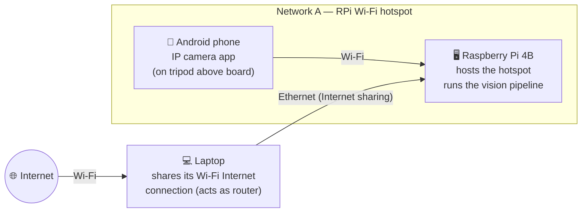

# Hardware setup

The reference rig: an Android phone streams the board over MJPEG to a Raspberry
Pi that runs the vision pipeline, with a laptop providing Internet.

| Component | Role |
| --- | --- |
| Android phone | Mounted on a tripod above the board, streams video via an IP camera app |
| Raspberry Pi 4B | Hosts its own Wi-Fi hotspot for the phone to join; runs the vision pipeline (`gm-detect`) |
| Laptop | Connected to the RPi over Ethernet; shares its own Wi-Fi Internet connection with the RPi (acts as a router) |
| Internet | Reached by the laptop over Wi-Fi, then passed through to the RPi via Ethernet |

Point `GRANDMASTER_STREAM_URL` at whatever URL the phone's IP camera app exposes
(see [configuration](configuration.md)). The Pi is CPU-only, so use an NCNN model
for inference — see [training: export](training.md#export-gm-export).
